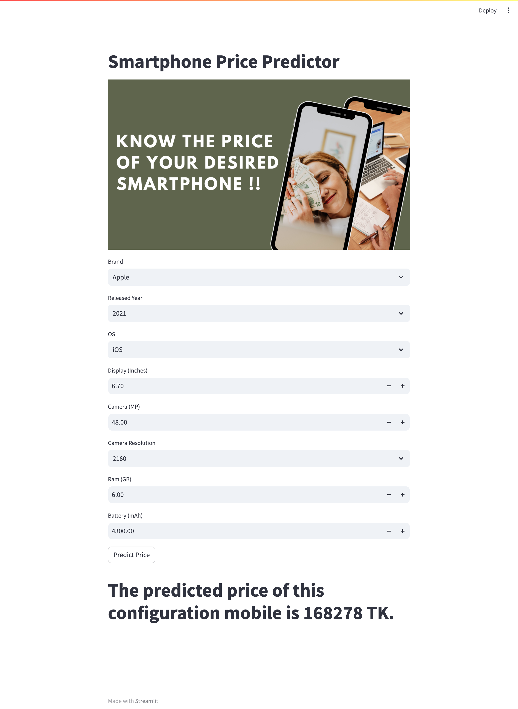

# Smartphone Price Predictor

Welcome to the Smartphone Price Predictor repository! This project leverages machine learning to predict the price of a smartphone in Bangladeshi Taka (TK) using various features of the device. The model is deployed using Streamlit for an interactive web application and also hosted on Hugging Face Spaces for broader accessibility.

## Overview

This repository includes:

1. **Data Collection**: The dataset used for training the model.
2. **Model Training**: Machine learning model for predicting smartphone prices.
3. **Deployment**: Instructions for deploying the model using Streamlit and Hugging Face.

## Dataset

The dataset contains detailed information about smartphones, including:

- **Brand**: The brand of the smartphone.
- **Model**: The specific model of the smartphone.
- **RAM**: The amount of RAM in GB.
- **Storage**: The internal storage capacity in GB.
- **Camera**: Camera specifications (e.g., dual 12MP).
- **Battery**: Battery capacity in mAh.
- **Screen Size**: Screen size in inches.
- **Processor**: Information about the processor.
- **Price (TK)**: The price of the smartphone in Bangladeshi Taka.

For more details about the dataset, please visit [Mobile Dataset](https://github.com/ripa01/mobile_dataset) on GitHub.

## Getting Started

### Prerequisites

To run the project locally, you need to have the following installed:

- Python 3.7 or higher
- Pandas
- Scikit-learn
- Streamlit
- Hugging Face `transformers`

You can install the required packages using pip:

```sh
pip install -r requirements.txt
```


### Streamlit Deployment

To run the Streamlit app locally, use the following command:

```sh
streamlit run app.py
```

This will launch a local web server where you can interact with the model to predict smartphone prices.

### Hugging Face Deployment

The model is also deployed on Hugging Face Spaces for easy access. You can find it [here](https://huggingface.co/spaces/ripa1/Mobile_price_predictor).

## Usage

To use the model for predicting smartphone prices, enter the features of the smartphone in the provided fields on the Streamlit app or the Hugging Face Spaces interface. The model will output the predicted price in TK.

## Screenshot


